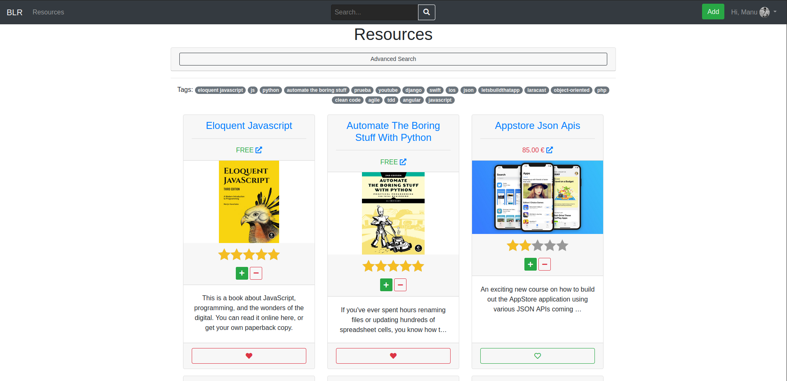

# Best Learning Resources (BLR)

## Manuel López Ramos, 2º DAW

Cuando se quiere aprender un lenguaje de programación o alguna nueva tecnología, encontramos una enorme cantidad de recursos. Pero..., ¿realmente son de calidad?. A partir de la gran cantidad de material con el que aprender disponible hoy día sería buena idea crear una plataforma donde se puedan aportar recursos que, con un sistema de puntuación para clasificarlos, nos permita disponer de aquellos que alcancen una calidad máxima.

## Construido con 🛠️

- [Python](https://www.python.org/)
- [Docker](https://www.docker.com/)
- [Django](https://www.djangoproject.com/)
  - [Django Cripsy Forms](https://github.com/django-crispy-forms/django-crispy-forms)
  - [Django Filter](https://github.com/carltongibson/django-filter)
  - [Django Taggit](https://github.com/jazzband/django-taggit)
  - [Django Vote](https://github.com/shellfly/django-vote)
  - [Django Comment](https://github.com/Radi85/Comment)
- [Starability](https://github.com/LunarLogic/starability)
- [PostgreSQL](https://www.postgresql.org/)

## Documentación

#### Un poco de info

> En proceso...
>

### Proyecto

La realización del proyecto la podemos dividir en tres partes, la primera sería el desarrollo de la plataforma de despliegue en **Docker**, la segunda el desarrollo del backend con **Django** y **Postgresql** y la última sería maquetación con **Bootstrap**.

Durante todo el desarrollo se ha hecho uso de Git y Github como sistema de control de versiones y he intentado trabajar mediante la metodología ágil Scrum.

[Repositorio GitHub](https://github.com/manu-lopez/proyectoDAW) y  [tablero canvas](https://www.notion.so/7e4f154453424c80861eaa69db7da816?v=6e010acf9cfa4f35a974ac66fecd9547) 

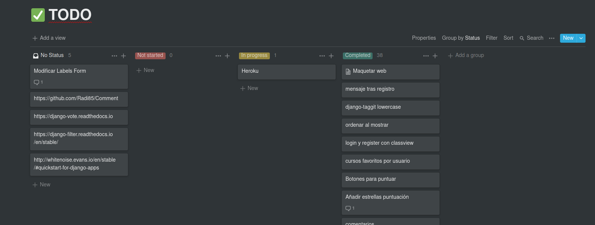

### Primera parte:

> Para esta parte me ha venido genial la realización del curso de OpenWebinars de [Docker para Desarrolladores](https://openwebinars.net/academia/portada/docker/)

El usar Docker como plataforma de despliegue nos aporta bastantes ventajas, ya que nos abstrae de nuestra plataforma personal de desarrollo y luego en producción con tener un VPS corriendo Linux es suficiente. De esta forma no tendremos problemas de compatibilidades ni conflictos con el resto de proyectos que podamos tener.

Docker contiene imagenes oficiales en [docker hub](https://hub.docker.com/), para este proyecto usaremos una imagen oficial y ademas crearemos una nosotros.

La imagen que vamos a crear es partir de la imagen oficial de [python](https://hub.docker.com/_/python). El archivo dockerfile es el siguiente.

#### dockerfile

```dockerfile
# Pull from official image
FROM python:3.8-buster

# This prevents Python from writing out pyc files
ENV PYTHONDONTWRITEBYTECODE 1

# This keeps Python from buffering stdin/stdout
ENV PYTHONUNBUFFERED 1

# Create and set work directory
RUN mkdir /code
WORKDIR /code

# Copy and install dependencies
COPY requirements.txt /code/

# Update system
RUN apt-get update

# Cloning and installing comment repository because installing with pip gives errors
RUN git clone https://github.com/radi85/Comment.git && cd Comment && python setup.py install

# Install rest django requeriments
RUN pip install -r requirements.txt

# Copy project
COPY /proyecto /code/
```

Como podemos ver, partimos de la imagen oficial `python:3.8-buster` (buster es una versión debian) y luego procedemos a "formar" nuestra imagen Python con **Django**.

Hemos comentado que haciamos uso de dos imagenes, por lo que tenemos que tener hacer uso de `docker-compose` y por lo tanto necesitamos el siguiente archivo.

#### docker-compose.yml

```yaml
version: '3'

services:
  db:
    image: postgres:11.7
    container_name: container_postgres
    restart: always
    environment:
      POSTGRES_USER: "YOUR USER"
      POSTGRES_PASSWORD: "YOUR PASSWORD"
    ports:
      - "5432:5432"
    volumes:
      - ./postgres_data:/var/lib/postgresql/data/

  web:
    image: djangoslim
    container_name: container_django
    build: .
    command: python manage.py runserver 0.0.0.0:8000
    volumes:
      - ./proyecto:/code
    ports:
      - "8000:8000"
    depends_on:
      - db 
      
volumes:
  postgres_data:
```

Lo más relevante que podemos comentar de este documento para que comprendan es lo siguiente:

- `services`: Tenemos dos servicios, que son `db`y `web`, que corresponde a nuestros dos contenedores y además tenemos `volumes` que como el nombre indica, es un volumen donde tenemos los datos de la base de datos y de está manera conseguimos cierta persistencia, ya que podremos borrar y reconstruir los contenedores si lo necesitamos, pero no perderemos los datos.
- `image`: En este campo procedemos a seleccionar la imagen que usaremos en nuestro contenedor, para el contenedor `db` usamos la imagen oficial de postgres en su version `11.7` y para `web` la imagen que creamos antes en el archivo [`dockerfile`](#dockerfile) (se lo indicamos en `build`: .).
- `depends_on`: Le indicamos dependencia entre servicios.
- `ports` y `volumes`: Funcionan de la siguiente manera: `"puerto local":"puerto contenedor"` || `"ruta local":"ruta contenedor"`. Al tener los volumes, tanto nosotros como el contenedor accedemos al código en el mismo lugar (nuestra carpeta `proyecto`en este caso concreto)

De esta manera tenemos nuestra paltaforma de desarrollo y despliegue. [Aquí](#instalación) podemos seguir los pasos necesarios para realizar la instalación.

### Segunda parte:

Está es la parte más amplia y compleja del proyecto, a parte de lo [visto](https://mentecatodev.github.io/django/) en la asignatura de DWES, realicé el curso de [Django](https://openwebinars.net/academia/portada/curso-online-django/) de OpenWebinars, que aunque es sobre una versión antigua, me sirvió para aclarar y conocer ciertos conceptos.

La plataforma permite lo siguiente:

- [Registro](#Registro).
- [Login, logout, cambiar contraseña](#login,-logout-y-cambiar-contraseña).
- [Creación de recurso](#creación-de-recurso).
- [Actualizar y borrar tus recursos](#actualizar-y-borrar-tus-recursos).
- [Guardar recursos como favoritos](#guardar-recursos-como-favoritos).
- [Página usuario](#página-usuario).
- [Votar recursos](#votar-recursos).
- [Tags](#tags).
- Buscar cursos (según varios parámetros)
- Comentar.

#### Configuración base de datos.

Para que Django pueda conectar con Postgres, tenemos que configurarlo y eso lo hacemos en  `settings.py`.

```python
...
DATABASES = {
    'default': {
        'ENGINE': 'django.db.backends.postgresql',
        'NAME': 'postgres',
        'USER': 'user',
        'PASSWORD': 'pwd',
        'HOST': 'db',  # Nombre del contenedor
        'PORT': '5432',
    }
}
...
```

Con eso y con [psycopg2](https://pypi.org/project/psycopg2/) ya tenemos nuestro Django funcionando con Postgres.

La estructura de la base de datos la hacemos con los modelos de Django, no necesitamos realizar un archivo sql ya que se encarga de ello. Pero si que debemos seguir conocer como funcionan, para establecer los tipos y relaciones correctos a los atributos.

#### Modelos

Para nuestra plataforma hemos necesitado crear tres modelos.

- Profile
- Type
- Resource

El modelo `Profile` extiende de `User` del propio Django, de esta manera podemos añadirle algún campo más.

```python
class Profile(models.Model):
    user = models.OneToOneField(User, on_delete=models.CASCADE)
    profile_pic = models.ImageField(default="default/profile1.png", null=True, blank=True)
```

El modelo `Type` nos indica que tipo de recurso es (libro, video, web, etc)

```python
class Type(models.Model):
    type_name = models.CharField(max_length=20)
```

Y `Resource`.

```python
class Resource(VoteModel, models.Model):
    resource_name = models.CharField(max_length=100)
    resource_description = models.TextField()
    resource_author = models.CharField(max_length=50)
    resource_image = models.ImageField(default="default/default.png")
    user_saved = models.ManyToManyField(Profile, related_name='votes', blank=True)
    resource_url = models.URLField()
    resource_price = models.DecimalField(
        default=0, max_digits=4, decimal_places=2)
    resource_creation_date = models.DateField(auto_now_add=True)
    post_author = models.ForeignKey(Profile, related_name='post_author', null=True, on_delete=models.SET_NULL)
    resource_slug = models.SlugField(unique=True, max_length=100)
    resource_tags = TaggableManager()
    resource_type = models.ForeignKey(Type, on_delete=models.CASCADE,)
    resource_stars = models.IntegerField(default=0)
    comments = GenericRelation(Comment)
```

Vamos a explicar un poco que tenemos en este modelo.

```python
class Resource(VoteModel, models.Model):
```

`VoteModel` corresponge al paquete [Django Vote](https://github.com/shellfly/django-vote), que nos permite añadir la funcionalidad de votar a los recursos, aunque realmente usaremos parte de su funcionalidad.

```python
resource_image = models.ImageField(default="default/default.png")
```

En el caso de que el usuario no suba una imagen al recurso, establecemos una por defecto nosotros.

```python
user_saved = models.ManyToManyField(Profile, related_name='votes', blank=True)
```

Aquí tenemos la primera relación del modelo, que nos servirá para almacenar los usuarios que le han dado favorito al recurso.

```python
post_author = models.ForeignKey(Profile, related_name='post_author', null=True, on_delete=models.SET_NULL)
```

La segunda relacion del modelo nos indica el usuario que ha publicado el recurso en nuestra plataforma. A diferencia de de ` resource_author` que es el creador del recurso. En el caso de que el usuario sea borrado, el campo quedara con `NULL` y no se eliminarán los recursos creados por este.

```python
resource_tags = TaggableManager()
```

Este atributo nos sirve para hacer uso de tags que relacionen las publicaciones. Usamos el paquete [Django Taggit](https://github.com/jazzband/django-taggit) para ello.

```python
resource_type = models.ForeignKey(Type, on_delete=models.CASCADE,)
```

En esta relación establecemos el tipo de cada recurso, según los que tengamos creados en `Type`

```python
resource_stars = models.IntegerField(default=0)
```

Este campo es el que estableceremos la cantidad de estrellas que tendremos en los recursos. Estableceremos cuantas estrellas le corresponde a partir de los votos obtenidos con [Django Vote](https://github.com/shellfly/django-vote)

```python
comments = GenericRelation(Comment)
```

Y este último atributo es el que nos permitirá añadir la funcionalidad de comentarios a partir de [Django Comment](https://github.com/Radi85/Comment).

#### Registro

Vamos a ver como se ha realizado la funcionalidad de registro.

En `views` tenemos el siguiente código correspondiente

```python
def registerPage(request):
    # Establecemos el formulario de creación de usuario
    form = CreateUserForm()

    # Controlamos que el usuario no ha iniciado sesión, si lo está se le redirige al inicio
    if request.user.is_authenticated:
        return redirect('resource-list')
    else:
        if request.method == 'POST':
            # Pasamos a form los datos obtenidos por POST
            form = CreateUserForm(request.POST)
            
            # Si es valido, hacemos el registro, redirigimos a página de login y  
            # mandamos un mensaje notificando que se ha creado.
            if form.is_valid():
                user = form.save()
                username = form.cleaned_data.get('username')
                messages.success(request, "Account was created for " + username)
                return redirect('login')
	
    context = {'loginForm' : form}
    return render(request, 'registration/register.html', context)
```

Formulario `CreateUserForm`

```python
class CreateUserForm(UserCreationForm):
  # Indicamos el modelo que tenemos que usar, además de los campos a mostrar.
  class Meta:
    model = User
    fields = ['username', 'password1', 'password2']
  
# Tenemos que sobreescribir el método save para establecer que el usuario es staff
  def save(self, commit=True):
    user = super(CreateUserForm , self).save(commit=False)
    user.is_staff = True

    if commit:
      user.save()

    return user
```

Como indicamos en los [modelos](#modelos), tenemos `Profile` que extiende de `User`, pero no hemos visto que lo creemos por ahora. Para ello tenemos estos métodos en `models.py`

```python
@receiver(post_save, sender=User)
def create_user_profile(sender, instance, created, **kwargs):
    if created:
        Profile.objects.create(user=instance)

@receiver(post_save, sender=User)
def save_user_profile(sender, instance, **kwargs):
    instance.profile.save()
```

Cuando detecta una señal de guardado desde `User`, creamos o guardamos en `Profile`.

Y nuestra template `register.html` es la siguiente

```html




<div class="mt-3">
  <h3>Register</h3>
  <form method="POST">
    {{ loginForm.username|as_crispy_field }}
    {{ loginForm.password1|as_crispy_field }}
    {{ loginForm.password2|as_crispy_field }}
    <button class="btn btn-lg btn-primary btn-block" type="submit">Create</button>
  </form>

  <p>Already have an account? <a href="">Login</a></p>
</div>

```

Y así se vería.

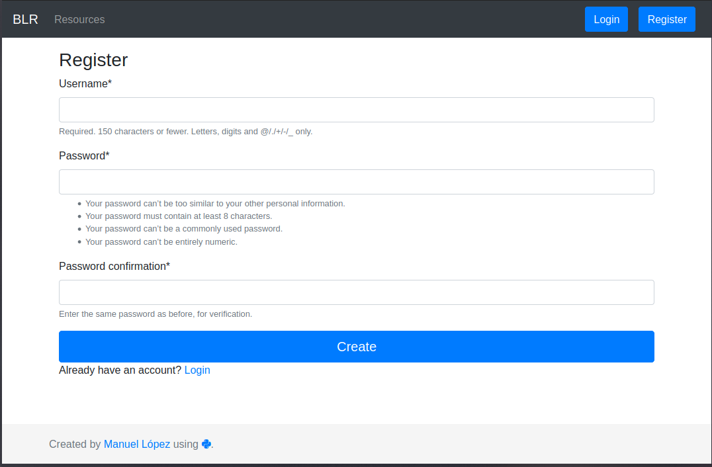

#### Login, logout y cambiar contraseña

Para estas opciones hemos usado vistas basadas en clases (CBV) que nos proporciona Django, de esta manera reutilizamos código y hacemos más simple la aplicación.

> views.py

```python
# Login view
class loginView(LoginView):
    redirect_authenticated_user = True

# Logout view
class logoutView(LogoutView):
    next_page = 'login'

# Change Password View
class changePassword(PasswordChangeView):
    success_url = 'userPage'
```

> login.html

```html




<h3>Login</h3>

<p>{{ message }}</p>

<form method="POST">
  {{ form|crispy }}
  <button class="btn btn-lg btn-primary btn-block" type="submit">Login</button>
</form>
<p>Dont have an account? <a href="">Register</a></p>

```

> password_change_forml.html

```html




<h3>Change Password</h3>
<form method="POST">
  {{ form|crispy }}
  <button class="btn btn-lg btn-primary btn-block" type="submit">Login</button>
</form>

```

Y con esto y tenemos las funciones creadas.

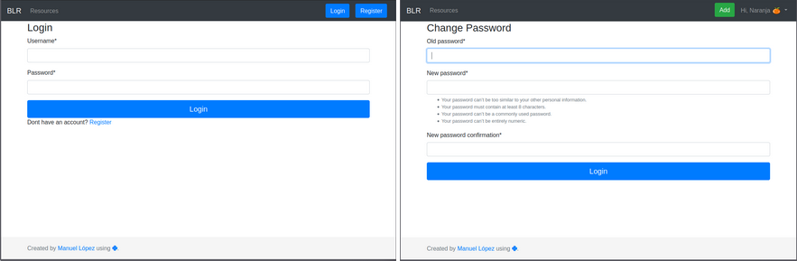


#### Creación de recurso

Para la creacion de recurso hacemos uso de la CBV CreateView

> views.py

```python
# Controlamos que solo usuarios autentificados puedan acceder, con
# el mixin LoginRequiredMixi
class ResourceCreate(LoginRequiredMixin, CreateView):
    login_url = '/login/'
    redirect_field_name = 'redirect_to'
    form_class = ResourceForm
    template_name = "blr/resource_create.html"
	
    def form_valid(self, form):
    	# Establecemos como autor del recurso publicado, al usuario 
        # que esta realizando la petición y además formamos el slug
        # del recurso a partir del nombre de este.
    	form.instance.post_author = self.request.user.profile
        form.instance.resource_slug = slugify(form.instance.resource_name)
        
        # Ya que el slug debe ser único, comprobamos que se puede crear
        # si no es posible, avisamos al usuario y no creamos el recurso.
        try:
            return super().form_valid(form)
        except IntegrityError as e:
            # Recogemos los datos mandados para volver a mostrarlos y no
            # hacer que el usuario tenga que rellenar todo de nuevo.
            form = ResourceForm(self.request.POST)
            # Usamos el sistema de mensajes de Django basados en las cookies
            # y las sesiones.
            messages.add_message(self.request,messages.WARNING,"Resource name already exists")
            return super().form_invalid(form)
```

> forms.py

```python
class ResourceForm(ModelForm):
  
  class Meta: 
    model = Resource
    # Excluimos estos campos del formulario. Ya que no los debe rellenar el usuario.
    exclude = ['vote_score','num_vote_up','num_vote_down','user_saved', 'post_author', 'resource_slug', 'resource_stars']
    labels = {
      'resource_tags': _('Resource tags')
    }
```

> resource_create.html

```html




<h3>Add Resource</h3>


<div class="pb-3">
    <ul class="text-danger messages">
        
        <li  class="{{ message.tags }}" >{{ message }}</li>
        
    </ul>
    

    <form method="POST" enctype="multipart/form-data">
        {{ form|crispy }}
        <button type="submit" class="save btn btn-success">Save</button>
    </form>
</div>

```

Y con esto tenemos la opción de crear recursos.


#### Actualizar y borrar tus recursos

Si somos los creadores del recurso en nuestra plataforma, nos aparecerán estos botones.

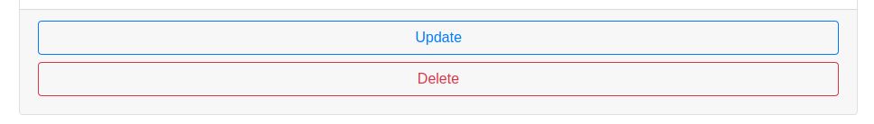

> views.py

```python
# Vista para actualizar recurso
class ResourceUpdate(UpdateView):
    model = Resource
    form_class = ResourceForm
    template_name = "blr/resource_modify.html"
    slug_url_kwarg = 'slug'
    slug_field = 'resource_slug'

    def get_queryset(self):
        qs = super(ResourceUpdate, self).get_queryset()
        return qs.filter(post_author=self.request.user.profile)

# Vista para borrar recurso
class ResourceDelete(DeleteView):
    model = Resource
    success_url = reverse_lazy('resource-list')
    slug_url_kwarg = 'slug'
    slug_field = 'resource_slug'

    def get_queryset(self):
        qs = super(ResourceDelete, self).get_queryset()
        return qs.filter(post_author=self.request.user.profile)
```

> resource_modify.html

```html




<div class="mt-3 pb-3">
  <h3>Update Resource</h3>
  <form method="POST">
    {{ form|crispy }}
    <button type="submit" class="edit btn btn-info">Edit</button>
  </form>
</div>

```

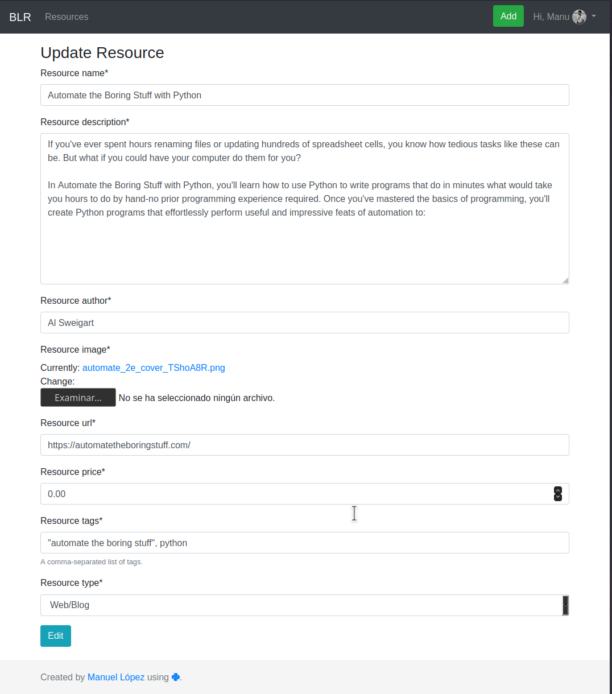

> resource_confirm_delete.html

```html



<div class=" mt-5">
  <div class="jumbotron">
    <h3>Confirm delete resource.</h3>
    <form method="post">
      <p>Are you sure you want to delete "{{ object }}" resource?</p>
      <button class="btn btn-lg btn-danger" type="submit" value="Confirm">Confirm</button>
    </form>
  </div>
</div>

```

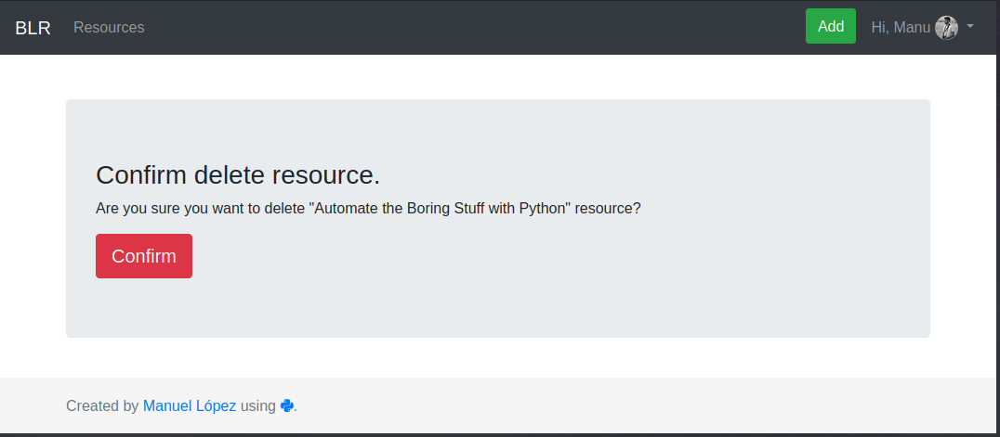


#### Guardar recursos como favoritos

Si el usuario está autenticado, podrá guardar como favorito los recursos.

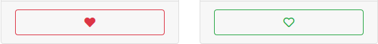

> views.py

```python
# Guarda como favorito el recurso
def save_resource(request):
    # Obtenemos el rescurso a guardar como favorito
    resource = get_object_or_404(Resource, id=request.POST.get('resource_id'))
    # Si esta guardado, lo borramos y si no lo guardamos.
    if resource.user_saved.filter(id=request.user.profile.id).exists():
        resource.user_saved.remove(request.user.profile)
    else:
        resource.user_saved.add(request.user.profile)
	
    # Redirigimos a la página donde se encontraba el usuario.
    return HttpResponseRedirect(request.META.get('HTTP_REFERER'))
```

Podemos guardar desde el template de todos los recursos o desde el del recurso detallado. Indicamos si está guardado como favorito con el icono del corazón rojo relleno y si no con el icono del corazon verde vacio.

> card.html

```html

    <div class="card-footer">
      <form action="" method="post">
        
        <button class="btn btn-block btn-outline-danger" type="submit" name="resource_id" value="{{ resource.id }}"><i
            class="fas fa-heart"></i>
        </button>
        
        <button class="btn btn-block btn-outline-success" type="submit" name="resource_id" value="{{ resource.id }}"><i
            class="far fa-heart"></i>
        </button>
        
      </form>
    </div>

```


#### Página usuario

Desde la página de usuario podemos cambiar la imagén (al crear cuenta se nos pone una por defecto), cambiar la contraseña actual, ver los recursos creados y los que hemos guardado como favoritos.

> views.py

```python
# Página de usuario
def userPage(request):
    # Obtenemos todos los recursos creados por el usuario
    resources = request.user.profile.post_author.all()
    # Obtenemos todos los recursos favoritos del usuario
    favorited = request.user.profile.votes.all()
    # Obtenemos el usuario
    user = request.user.profile
    # Indicamos el formulario de usuario
    form = UserForm(instance=user)

    if request.method == 'POST':
        form = UserForm(request.POST, request.FILES, instance=user)
        if form.is_valid():
            form.save()
    
    # Pasamos los recursos creados, los favoritos y el usario al template
    # para mostrarlos
    context = {'resources': resources, 'favorited':favorited, 'form': form}
    return render(request, 'blr/user.html', context)
```

> forms.py

```python
class UserForm(ModelForm):
  class Meta:
    model = Profile
    fields = '__all__'
    exclude = ['user']
```

Luego en el template `user.html` le damos forma y se vería de esta manera.

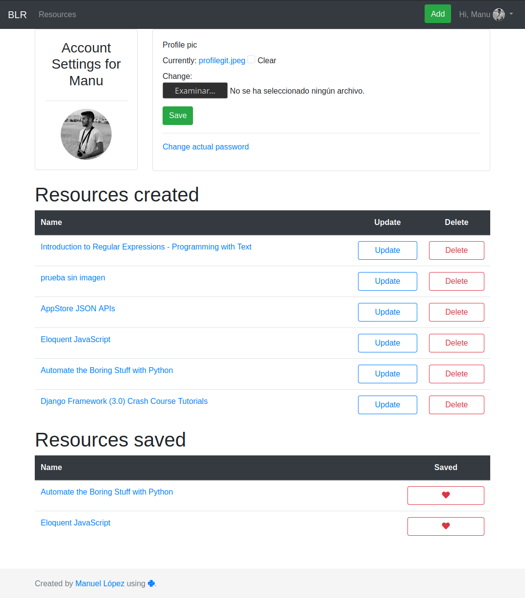


#### Votar recursos

Al estar registrado, tenemos la opcion de votar positiva o negativamente los recursos a través de estos botones

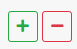

Antes comentamos que haciamos uso del paquete [Django Vote](https://github.com/shellfly/django-vote), y ahora vamos a explicar como lo usamos.

[Django Vote](https://github.com/shellfly/django-vote) nos añade estos campos a nuestro modelo `Resource` 

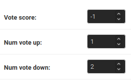

Nosotros queremos mostrar la calificacion con una puntuacion máxima de 5, pero como vemos en la imagen, no corresponde la cantidad de votos con la puntuación, por lo que tenemos que hacer un par de cosas que os explico direcamente en el código correspondiente.

> views.py

```python
def vote_resource(request):

    # Comprobamos la petición que nos viene del template
    if 'upvote' in request.POST:
        # Obtenemos el id del recurso que lo tenemos
        # en value del template
        rid=request.POST.get('upvote')
        # Obtenemos el recurso
        resource = get_object_or_404(Resource, id=rid)
        # Le añadimos un voto en vote_up
        resource.votes.up(request.user.profile.id)
		
        # Calculamos el total de votos que se han realizado, tanto negativos
        # como positivos
        total_votes = resource.num_vote_down + resource.num_vote_up
        # Si el primer voto es positivo, le indicamos las 5 estrellas 
        if total_votes == 0:
            resource.resource_stars = 5

    elif 'downvote' in request.POST:
        rid=request.POST.get('downvote')
        resource = get_object_or_404(Resource, id=rid)
        # Le sumamos un voto a los votos negativos
        resource.votes.down(request.user.profile.id)

        total_votes = resource.num_vote_down + resource.num_vote_up
        # Si el primer voto es negativo, le indicamos 0 estrellas
        if total_votes == 0:
            resource.resource_stars = 0

    # Procedemos a obtener el recurso pero con los votos actualizados
    after_vote_resource = get_object_or_404(Resource, id=rid)
    # Obtenemos todos la sumna de votos realizados
    total_votes = after_vote_resource.num_vote_down + after_vote_resource.num_vote_up
    # Solo realizamos el calculo si existe más de un voto
    # ya que si no estariamos diviendo 0 y tendriamos errores
    if total_votes > 0:
        # Obtenemos la cantidad que le corresponde con una puntuacion
        # máxima de 5 estrellas
        resource.resource_stars = round((after_vote_resource.num_vote_up * 5)/total_votes)
    
    # Actualizamos solo el campo de las puntuaciones
    resource.save(update_fields=['resource_stars'])

    return HttpResponseRedirect(request.META.get('HTTP_REFERER'))
```

Para indicar en el template si un usuario ha votado o no, tenemos que comprobarlo a medida que se va renderizando el contenido

> resource_list.html

```html
...

<!-- Comprobamos que ha votado el usuario -->



<!-- Card -->


...
```

Si ha votado `vote_exists` es 1 y si no es 0. Por lo tanto con condiciones mostramos unos u otros en las cards.

Para las estrellas, indicamos la cantidad en data-rating y [Starability](https://github.com/LunarLogic/starability) hace el resto.

> card.html

```html
...
<p class="starability-result mx-auto" data-rating="{{ resource.resource_stars }}">
    Rated: {{ resource.resource_stars }} stars
</p>
...

<button class="btn btn-success btn-sm" ... </button>

<button class="btn btn-outline-success btn-sm" ... </button>


<button class="btn btn-danger btn-sm" ... </button>

<button class="btn btn-outline-danger btn-sm"... </button>

...
```


#### Tags

> views.py

```python
class tagged(ListView):
    model = Resource
    template_name = "blr/resource_list_tagged.html"

    """More code"""
    
    def get_context_data(self, **kwargs):
        context = super().get_context_data(**kwargs)
        tag = get_object_or_404(Tag, slug=self.kwargs.get('slug'))
        if self.request.user.is_authenticated:
            context['is_saved'] = self.is_saved()
            context['search'] = ResourceSearch(self.request.GET, queryset=self.get_queryset())
            context['resource_tagged'] = Resource.objects.filter(resource_tags=tag)
            context['all_tags'] = Resource.resource_tags.all()

            return context
```

# Instalación

### Pre-requisitos 📋

Independientemente del sistema operativo que tengamos (Linux/MacOs/Windows), tenemos que tener instalado lo indicado a continuación:

- [Git](https://git-scm.com/downloads)
- [Docker](https://www.docker.com/products/docker-desktop)

### Instalación 🔧

Una vez tengamos todo instalado, el primer paso será clonar este repositorio.

```bash
git clone https://github.com/manu-lopez/proyectoDAW.git
```

A continuación debemos asegurarnos que tenemos Docker corriendo. 

```bash
# Podemos ejecutar uno de estos comandos
docker version 
docker info
```

Nos dará información de Docker o en el caso de que no esté corriendo, nos dirá que no consiguió conectar con el daemon.

Cuando tengamos seguro que Docker está funcionando, pasamos a construir el contenedor django.

```bash
docker-compose build
```

Una vez termine este proceso, pasamos a ejecutar el siguiente comando.

```bash
docker-compose up
```

De esta manera tendremos tanto django como postgres funcionando, a continuación debemos realizar un par de pasos dentro del contenedor de django.

```bash
# Entramos dentro del contenedor
docker exec -it container_django bash

# Lo siguiente será crear las migraciones y migrarlas.
python manage.py makemigrations
python manage.py migrate

# Por último creamos un super usuario
python manage.py createsuperuser

```

Ya podremos acceder a la plataforma como vemos en esta imagen.

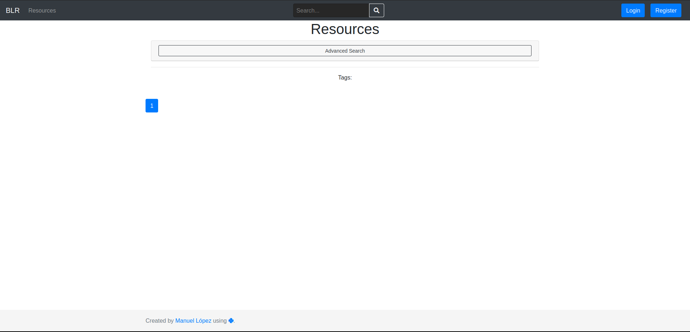

El último paso para tener completamente funcional la plataforma, es crear los tipos que creas convenientes para los recursos que aportaran los usuarios. Para ello entramos con nuestra cuenta de super usuario en `/admin` y añadimos los tipos en Types.

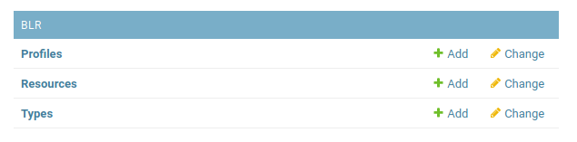

En este caso por ejemplo he añadido los siguientes.

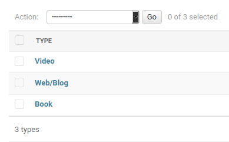

Con esto ya podemos crear recursos perfectamente.

## Autor ✒️

- [Manuel López Ramos](https://github.com/manu-lopez)